# Development tools

- [Development tools](#development-tools)
  - [1. GIT](#1-git)
    - [1.1 Basic commands](#11-basic-commands)
      - [1. Branch](#1-branch)
      - [2. Commit](#2-commit)
      - [3. Checkout](#3-checkout)
      - [4. Fetch](#4-fetch)
      - [5. Head](#5-head)
      - [6.  Index](#6--index)
      - [7. Master](#7-master)
      - [8. Merge](#8-merge)
      - [9. Origin](#9-origin)
      - [10. Pull](#10-pull)
      - [11. Push](#11-push)
      - [12. Rebase](#12-rebase)
      - [13. Stash](#13-stash)
    - [1.2 Basic Git flow](#12-basic-git-flow)
  - [2. SQL language and MySQL](#2-sql-language-and-mysql)
  - [3. Web servers](#3-web-servers)
  - [4. OpenServer](#4-openserver)
  - [5. PhpStorm](#5-phpstorm)
  - [6. Chrome dev tool](#6-chrome-dev-tool)
  - [7. Ngrok service](#7-ngrok-service)
  - [8. SSH connection and key generation](#8-ssh-connection-and-key-generation)
- [Excersices:](#excersices)

## 1. GIT

Git is a distributed version control system
- Git stores information in the form of a list of file-based changes and changes made to each file over time.

- In projects where there are often lots of developers working in parallel, 
Git is essential to ensure there are no code conflicts between developers.

- Some of the benefits of Git:
   - Easy to use, fast, quick and safe operation.
   - Easily combine branches.
   - Just clone the source code from the repository or clone a modified version from the repository, 
   or a branch from the repository, and you can work anywhere.
   - Deployment your product easily.

### 1.1 Basic commands

This great GitHub commands cheat sheet saved my butt multiple times:
<https://www.atlassian.com/git/tutorials/atlassian-git-cheatsheet>

- Some important Git terms:
#### 1. Branch
- Branches represent specific instances of a repository separate from your main Project.
- Branch allows you to keep track of your changes to the repository, so you can roll back to earlier versions.

#### 2. Commit
- Commit represents a specific moment in your project history. Using the commit and git add commands keeps your changes saved to local repository.

#### 3. Checkout
- Use **git checkout** to switch between branches
    - git checkout "name-branch"
 
#### 4. Fetch
- The git fetch command fetches the copies and downloads all branches to your computer.

#### 5. Head
- Commits at the beginning of a branch are called Head. 
It represents the most recent commit of the repository you are working on.

#### 6.  Index
- Whenever you add, edit, delete, or change a file, it stays in the index until you're ready to commit.
  Use git status to see those changes (file index).

#### 7. Master
- Master is the main branch of your repository. It includes the most recent changes and commits.

#### 8. Merge
- The git merge command combines pull requests to add changes from branch to branch.

#### 9. Origin
- git push origin master => to push local changes to the main branch.

#### 10. Pull
- To pull all of the pushed code back to your branch

#### 11. Push
- The git push command is used to push the code to your branch.

#### 12. Rebase
- The git rebase command allows you to split, move, and exit a commit. It can also be used to combine two branches.

#### 13. Stash
- Use git stash when you want to record the current state of the working directory and the index, but want to go back to a clean working directory.  


### 1.2 Basic Git flow
Check out the branch from the develop branch

Before checking out the branch you should pull the code back.
```
 git pull
```
How to name the branch: id_task-description_task
```
git checkout "id_task-description_task"
```
After completing the assigned task, commit with the following syntax:
``` 
git commit -m "#id_task-description"
```    
After committing, you push the code to the branch:
``` 
git push origin name_branch
```


## 2. SQL language and MySQL

Structured query language (SQL) is a programming language for storing and processing information in a relational database. 

A relational database stores information in tabular form, with rows and columns representing different data attributes and the various relationships between the data values. You can use SQL statements to store, update, remove, search, and retrieve information from the database. You can also use SQL to maintain and optimize database performance.

- MySql is an open source database administration system.
- Some free tools to use as MySql:
    - MySql Workbench (Mac, Windows, Linux), free, open source.
    - HeidiSQL (Windows), free.
    - PhpMyAdmin (web app), free, open source.

Please do the exercises with SQL queries [here](https://github.com/nccasia/ncc-python-learning/tree/main/database)
    
## 3. Web servers
- Apache is a server program that communicates using the HTTP protocol 
and works on most operating systems such as Linux, Windows, Unix and many other operating systems.

- Nginx is an HTTP and reverse proxy server, a mail proxy server, and a generic TCP/UDP proxy server, originally written by Igor Sysoev.

## 4. OpenServer
- OpenServer is a software for creating webserver on windows from Russia, and there are many good utilities built in.
- OpenServer provides users with a variety of platforms to test their products and run well in all environments.

- Download and install OpenServer
    - Step 1: Access the [link download](https://ospanel.io/) and select an installation file and corresponding configuration file to download and install.
    - Step 2: Once downloaded we will have a file with the name Open_server _ ***. Exe, run the file to begin the installation.
    - Step 3: Configure and use OpenServer.
    - To make it easier to visualize the installation process, you go to [Link](https://freetuts.net/cai-dat-openserver-va-tao-domain-ao-tren-localhost-281.html)
    
- Config OpenServer

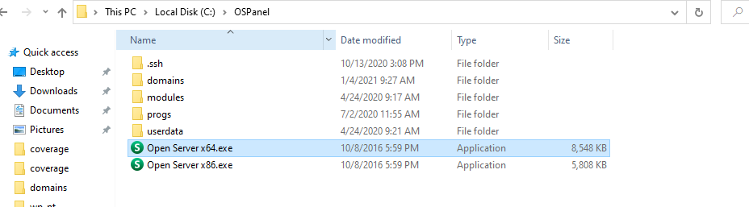

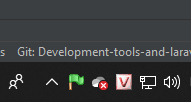

- Then, click on the OpenServer icon under the setting toolbar, the screen below will appear:

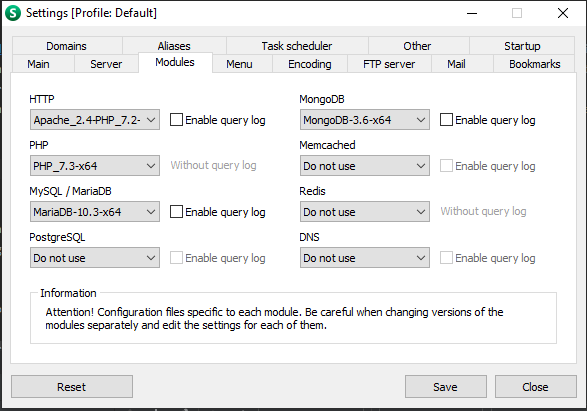

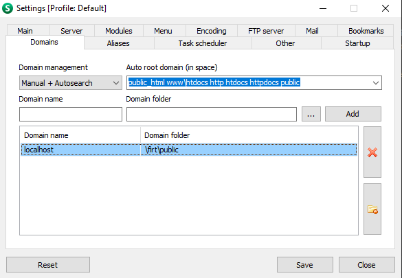

## 5. PhpStorm
- Phpstorm is a cross-platform, integrated development environment (IDE) for PHP, 
built by JetBrains, the world's leading software maker for programming and development tools.

- PhpStorm provides an editor for PHP, HTML and JavaScript with fast code analysis, 
error prevention, and automatic refactoring for PHP and JavaScript code.

**Configure PHPStorm interpreter:**

1. In PHPStorm, go to "File" menu (Windows), then Settings (Ctrl+Alt+S).
2.Go to "Languages & Frameworks", then click on "PHP".
1. Click the **_..._** button from the "CLI Interpret" field.
2. Add a new interpreter by clicking the + button.
3. Here, provide the PHP Executable path to the php.exe we've spotted earlier:

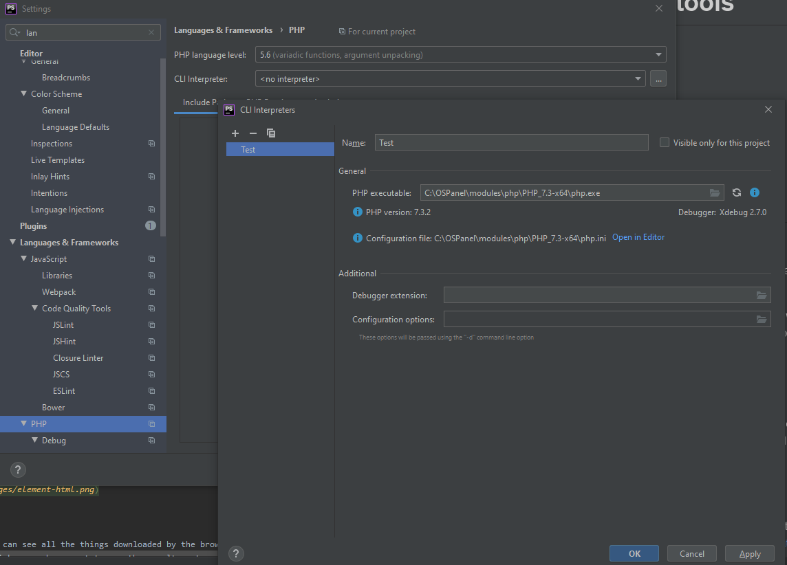

If done correctly, PHPStorm will display the PHP version & the path to the configuration file (php.ini)

**Setup format code**

Open up the PHPStorm IDE. Into the [ File ] -> [ Setting ] -> [ Editor ] -> [ Code Style ] -> [ PHP ]
    
    - Scheme: Default IDE
    - Click set from …
    
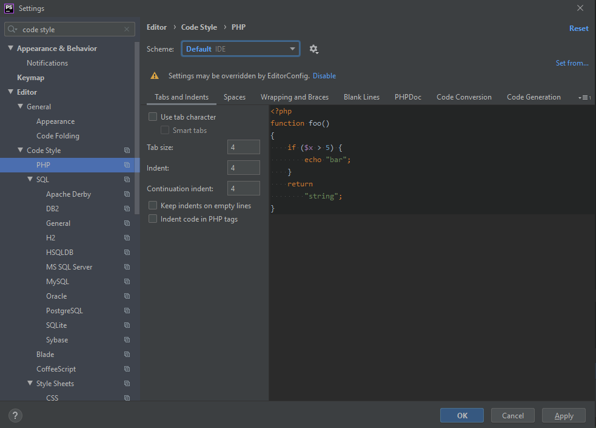

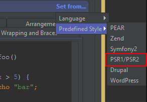

PhpStorm can help ensure your code adheres to whichever coding standard you follow. 
Press Ctrl+Alt+L on Windows/Linux to reformat the source code for the current selection or the entire file if nothing is selected.

**Setup unit test**

Open up the PHPStorm IDE. Into the [ File ] -> [ Setting ] -> [ Languages & Frameworks ] -> [ PHP ] -> [ Test Frameworks ]

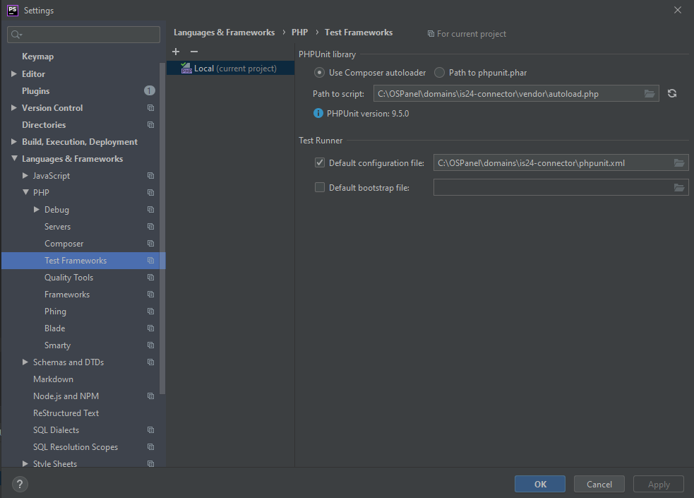

## 6. Chrome dev tool

The Chrome Developer Tool is a suite of tools that are hugely supportive for developers built into Google Chrome. DevTools provides web developers with internal access to their browsers and web applications. Use DevTools to efficiently edit HTML, CSS, and JavaScript and get insights to optimize code.

**Elements**

This tab displays the HTML of the web page elements.
We can directly edit the CSS of an element in the right pane, see the results immediately.

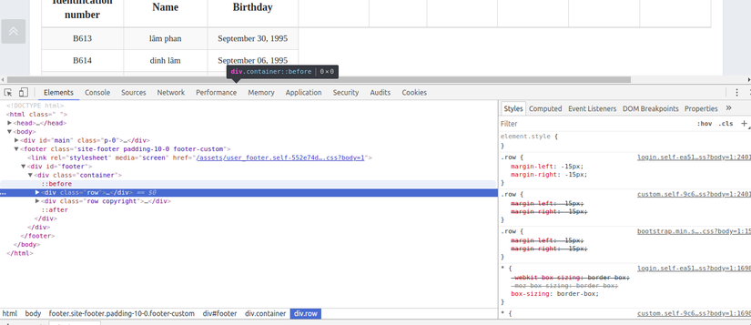

**Networks**

On this tab, we can see all the things downloaded by the browser from the server: HTML, CSS, JS, images, ... 
You can also click on each request to see the results returned from the server, check error.

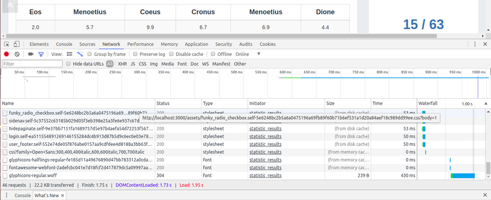

**Console**

We can directly enter the js code here to run, this is a great feature to be able to test each js code individually.
The errors related to javascript (not load, syntax, ...) will show up in this tab.

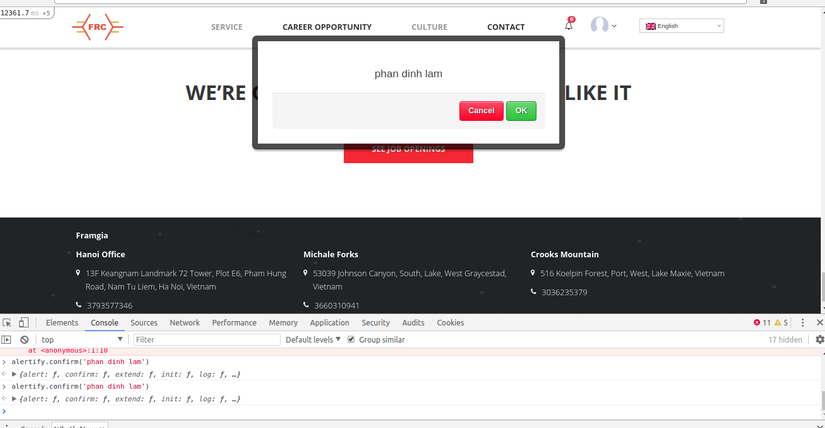

**Sources**

This tab shows the js files that the browser can load. At this tab, you can debug code js with breakpoints.

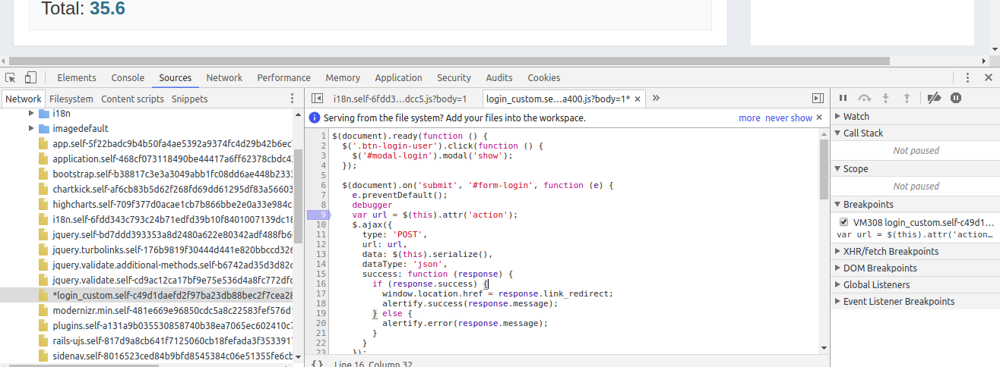


## 7. Ngrok service

ngrok secure introspectable tunnels to localhost webhook development tool and debugging tool.

ngrok is a simplified API-first ingress-as-a-service that adds connectivity,
security, and observability to your apps with no code changes

## 8. SSH connection and key generation


# Excersices:

1. Open Chrome devtool, open google.com, list out all css, js requests
2. run and publish a local website via ngrok, check request logs
3. Create a bitbucket account, generate a SSH key, push a local repo onto Bitbucket
   