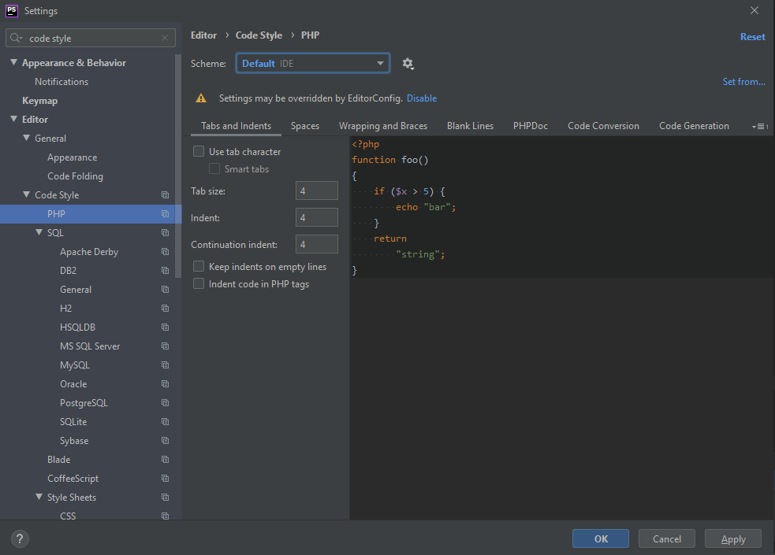
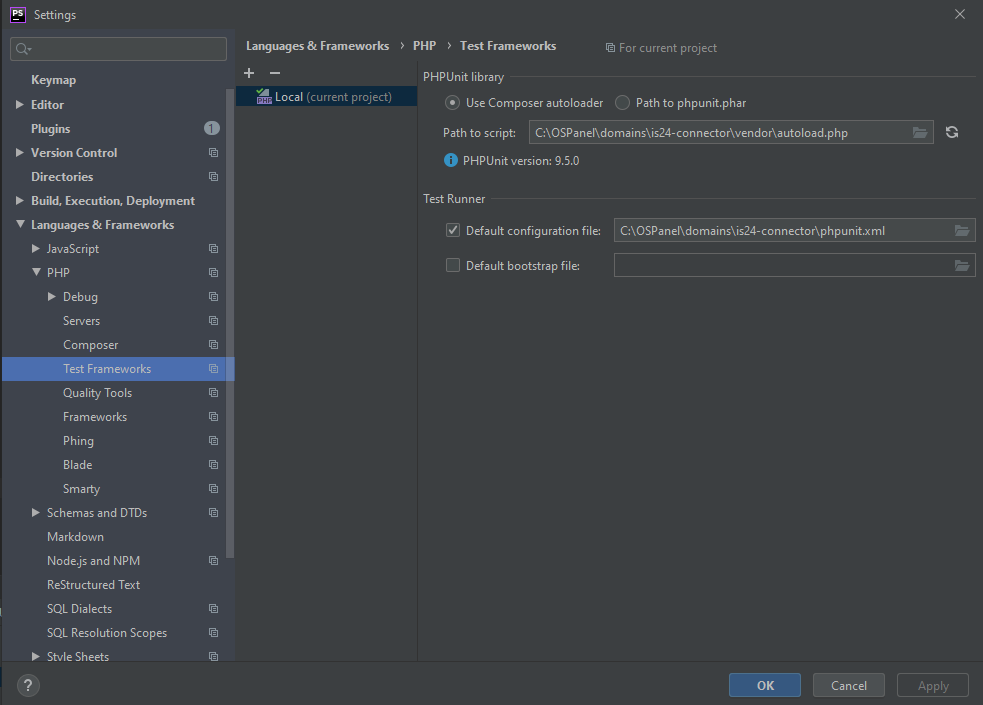

# Chapter 04: GIT and PhpStorms

1. [GIT](#1-git)
  - [1.1 Basic commands](#11-basic-commands)
  - [1.2 Basic Git flow](#12-basic-git-flow)
    - [1. Branch](#1-branch)
    - [2. Commit](#2-commit)
    - [3. Checkout](#3-checkout)
    - [4. Fetch](#4-fetch)
    - [5. Head](#5-head)
    - [6.  Index](#6--index)
    - [7. Master](#7-master)
    - [8. Merge](#8-merge)
    - [9. Origin](#9-origin)
    - [10. Pull](#10-pull)
    - [11. Push](#11-push)
    - [12. Rebase](#12-rebase)
    - [13. Stash](#13-stash)

2. [PhpStorm](#2-phpstorm)

## 1. GIT

Git is a distributed version control system
- Git stores information in the form of a list of file-based changes and changes made to each file over time.

- In projects where there are often lots of developers working in parallel, 
Git is essential to ensure there are no code conflicts between developers.

- Some benefits of Git:
   - Easy to use, fast, quick and safe operation.
   - Easily combine branches.
   - Just clone the source code from the repository or clone a modified version from the repository, 
   or a branch from the repository, and you can work anywhere.
   - Deployment your product easily.

### 1.1 Basic commands

This great GitHub commands cheat sheet saved my butt multiple times:
<https://www.atlassian.com/git/tutorials/atlassian-git-cheatsheet>

### 1.2 Basic Git flow
Check out the another branch

    - git checkout another_branch

Pull code from remote repository

    - git pull origin branch_name

Create new branch from base branch and checkout

    - git checkout -b new_branch_nem

Check your changes

    - git status

Add changed files to staging (use 1 space after every file path)

    - git add src/directory1/file1.xy src/directory2/file2.zt src/directory3/file3.ab

After completing the assigned task, commit with the following syntax:

    - git commit -m"#id_task-description"
    
After committing, you push the code to the branch:

    - git push origin name_branch

- Some important Git terms:
#### 1. Branch
- Branches represent specific instances of a repository separate from your main Project.
- Branch allows you to keep track of your changes to the repository, so you can roll back to earlier versions.

#### 2. Commit
- Commit represents a specific moment in your project history. Using the commit and git add commands keeps your changes saved to local repository.

#### 3. Checkout
- Use **git checkout** to switch between branches
    - git checkout "name-branch"
 
#### 4. Fetch
- The git fetch command fetches the copies and downloads all branches to your computer.

#### 5. Head
- Commits at the beginning of a branch are called Head. 
It represents the most recent commit of the repository you are working on.

#### 6.  Index
- Whenever you add, edit, delete, or change a file, it stays in the index until you're ready to commit.
  Use git status to see those changes (file index).

#### 7. Master
- Master is the main branch of your repository. It includes the most recent changes and commits.

#### 8. Merge
- The git merge command combines pull requests to add changes from branch to branch.

#### 9. Origin
- git push origin master => to push local changes to the main branch.

#### 10. Pull
- To pull all the pushed code back to your branch
    - git pull

#### 11. Push
- The git push command is used to push the code to your branch.

#### 12. Rebase
- The git rebase command allows you to split, move, and exit a commit. It can also be used to combine two branches.

#### 13. Stash
- Lệnh git stash để lưu lại các công việc mình đang làm việc trên branch hiện tại, 
dùng git stash pop để quay trở lại thời điểm chưa git stash.  

## 2. PhpStorm
- Phpstorm is a cross-platform, integrated development environment (IDE) for PHP, 
built by JetBrains, the world's leading software maker for programming and development tools.

- PhpStorm provides an editor for PHP, HTML and JavaScript with fast code analysis, 
error prevention, and automatic refactoring for PHP and JavaScript code.

- By 2020, there are about 600,000 users using copyright PhpStorm software worldwide.

**Configure PHPStorm interpreter:**

1. In PHPStorm, go to "File" menu (Windows), then Settings (Ctrl+Alt+S).
2. Go to "Languages & Frameworks", then click on "PHP".
3. Click the **_..._** button from the "CLI Interpret" field.
4. Add a new interpreter by clicking the + button.
5. Here, provide the PHP Executable path to the php.exe we've spotted earlier:

If done correctly, PHPStorm will display the PHP version & the path to the configuration file (php.ini)

**Setup format code**

Open up the PHPStorm IDE. Into the [ File ] -> [ Setting ] -> [ Editor ] -> [ Code Style ] -> [ PHP ]
    
    - Scheme: Default IDE
    - Click set from …
    

PhpStorm can help ensure your code adheres to whichever coding standard you follow. 
Press Ctrl+Alt+L on Windows/Linux to reformat the source code for the current selection or the entire file if nothing is selected.

**Setup unit test**

Open up the PHPStorm IDE. Into the [ File ] -> [ Setting ] -> [ Languages & Frameworks ] -> [ PHP ] -> [ Test Frameworks ]

**Install Phpstorm**
- Please refer to the following link:
[link download and setup phpstorm](https://khophanmem24h.com/download-phpstorm-2019/)
