- [MVC pattern](#mvc-pattern)
  - [Activity flow of MVC](#activity-flow-of-mvc)
  - [Example](#example)
- [API RESTful](#api-restful)
  - [What is API](#what-is-api)
  - [What is Web API](#what-is-web-api)
  - [What is REST](#what-is-rest)
  - [What is API RESTful](#what-is-api-restful)
  - [Guiding Principles of REST](#guiding-principles-of-rest)
- [User Authentication and authorization methods](#user-authentication-and-authorization-methods)
- [Exercise:](#exercise)
- [Result](#result)


# MVC pattern

MVC is an acronym which stands for 3 words Model - View - Controller. 
Source code model into 3 parts, corresponding to each word. 
Each word corresponds to a separate activity in a pattern.

**Functions of each component in the MVC model:**

**- Model (M):** The part that stores all of the application's data. 
This part is a bridge between two components below is View and Controller.
The model shown in the form is a database.
It shows operations with the database such as retrieving and processing data.

**- View (V):** This is the interface (theme) for the user. 
It is responsible for displaying data and helping users interact with the system.

**- Controller (C):** Controller is responsible for handling user requests through the view. 
From there, Controller gives the data relevant to the user. 
Besides, Controller also has the function to connect to the model.

## Activity flow of MVC

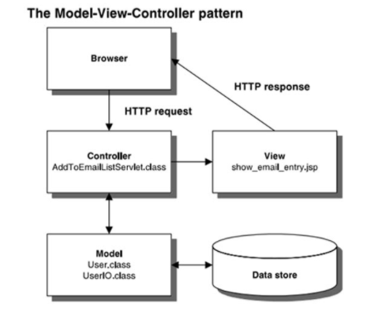

- After receiving a request from the browser, Controller will interact with the model to get data. 
The model interacts with the database to get data, 
the returned data is sent back to the Model, from the Model sent back to the Controller, 
the Controller calls View to transfer the data just received from the Model to the View, 
the View will render that data to the browser.

## Example

Here is an example taking all users for the user:

**- Controller:**

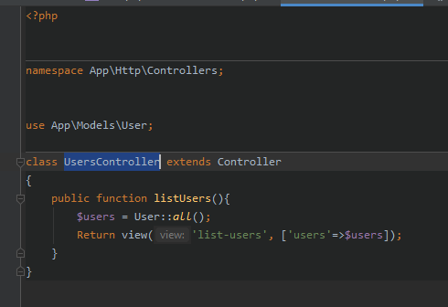

**- Model:**

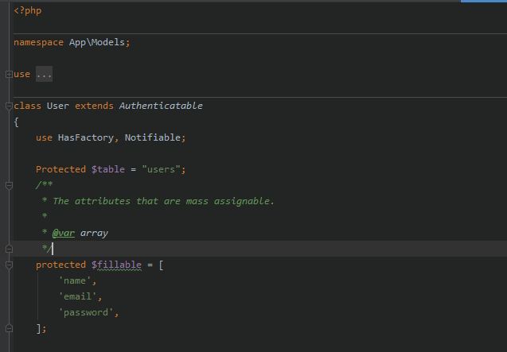

**- View:**

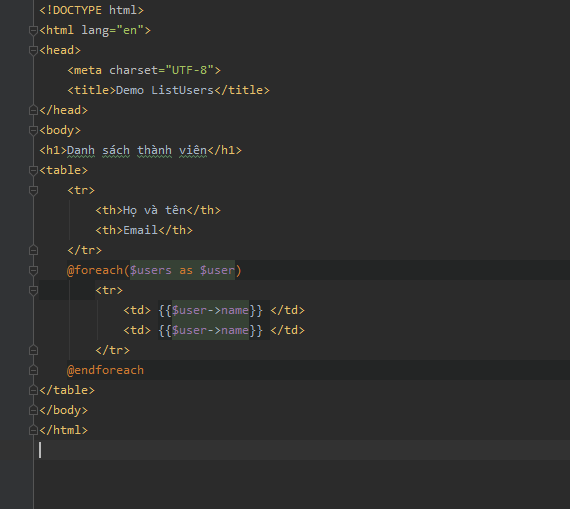

**- Database table users:**

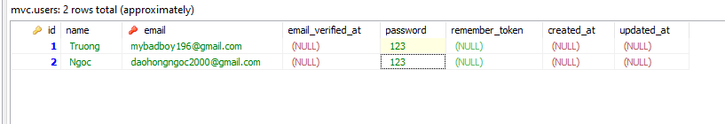

**- User Interface:**

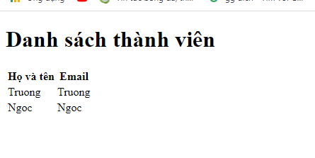

# API RESTful

## What is API

An application programming interface (API) is a way for two or more computer programs to communicate with each other. It is a type of software interface, offering a service to other pieces of software.

One purpose of APIs is to hide the internal details of how a system works, exposing only those parts a programmer will find useful and keeping them consistent even if the internal details later change.

## What is Web API

A Web API is an application programming interface for the Web.

```
Google Maps API
Twitter API
Facebook API
Stripe API (Payments)
AWS (Amazon Web Services) API
Twilio API (Communications)
Salesforce API
Slack API (Collaboration)
Stripe API (Payments)
Spotify API (Music)
```

## What is REST

REST, or REpresentational State Transfer, is an architectural style for providing standards between computer systems on the web, making it easier for systems to communicate with each other. REST-compliant systems, often called RESTful systems, are characterized by how they are stateless and separate the concerns of client and server

## What is API RESTful

A RESTful API is an architectural style for an application program interface (API) that uses HTTP requests to access and use data. That data can be used to GET, PUT, POST and DELETE data types, which refers to the reading, updating, creating and deleting of operations concerning resources.

A RESTful API uses commands to obtain resources. The state of a resource at any given timestamp is called a resource representation. A RESTful API uses existing HTTP methodologies defined by the RFC 2616 protocol, such as:

- GET to retrieve a resource;
- PUT to change the state of or update a resource, which can be an object, file or block;
- POST to create that resource; and
- DELETE to remove it.

Data formats the REST API supports include:
- application/json
- application/xml
- application/x-wbe+xml
- application/x-www-form-urlencoded
- multipart/form-data

## Guiding Principles of REST
- **Client–server** – By separating the user interface concerns from the data storage concerns, we improve the portability of the user interface across multiple platforms and improve scalability by simplifying the server components.
- **Stateless** – Each request from client to server must contain all of the information necessary to understand the request, and cannot take advantage of any stored context on the server. Session state is therefore kept entirely on the client.
- **Cacheable** – Cache constraints require that the data within a response to a request be implicitly or explicitly labeled as cacheable or non-cacheable. If a response is cacheable, then a client cache is given the right to reuse that response data for later, equivalent requests.
- **Uniform** interface – By applying the software engineering principle of generality to the component interface, the overall system architecture is simplified and the visibility of interactions is improved. In order to obtain a uniform interface, multiple architectural constraints are needed to guide the behavior of components. REST is defined by four interface constraints: identification of resources; manipulation of resources through representations; self-descriptive messages; and, hypermedia as the engine of application state.
- **Layered system** – The layered system style allows an architecture to be composed of hierarchical layers by constraining component behavior such that each component cannot “see” beyond the immediate layer with which they are interacting.
- **Code on demand** (optional) – REST allows client functionality to be extended by downloading and executing code in the form of applets or scripts. This simplifies clients by reducing the number of features required to be pre-implemented.

5. HTTP code response status code

- 200 OK
- 400 Bad Request
- 401 Unauthorized (Similar to 403 Forbidden, but specifically for use when authentication is required and has failed or has not yet been provided)
- 403 Forbidden (The request contained valid data and was understood by the server, but the server is refusing action.)
- 404 Not Found (The requested resource could not be found but may be available in the future. Subsequent requests by the client are permissible.)
- 405 Method Not Allowed
- 500 Internal Server Error 

# User Authentication and authorization methods


# Exercise:

Desribe Authentication methods for each pattern (MVC vs API) and explain

# Result

**- Authentication MVC:**
  - Create Migration
  
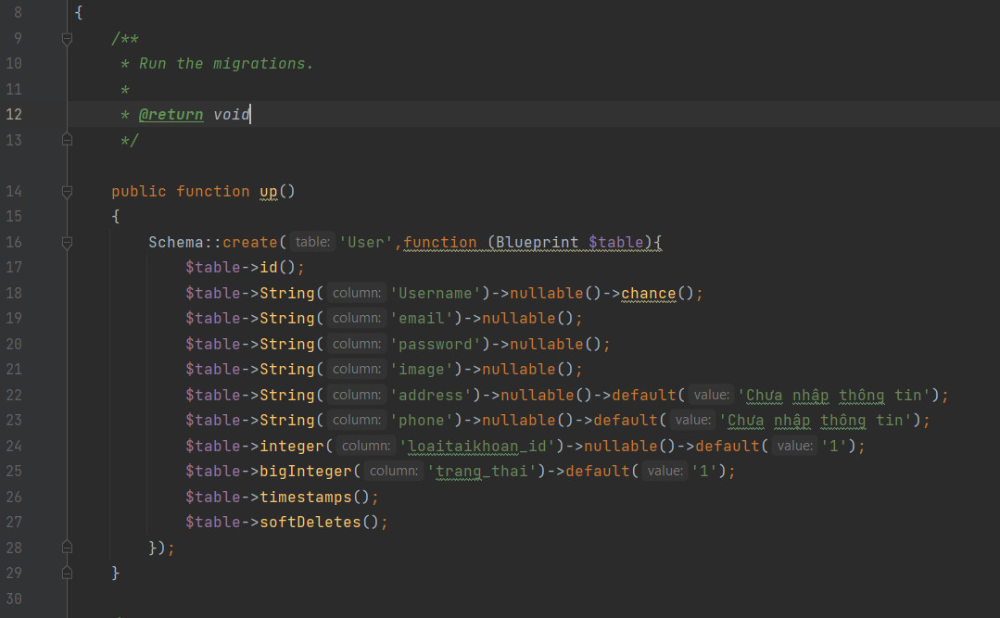

  - Create Model

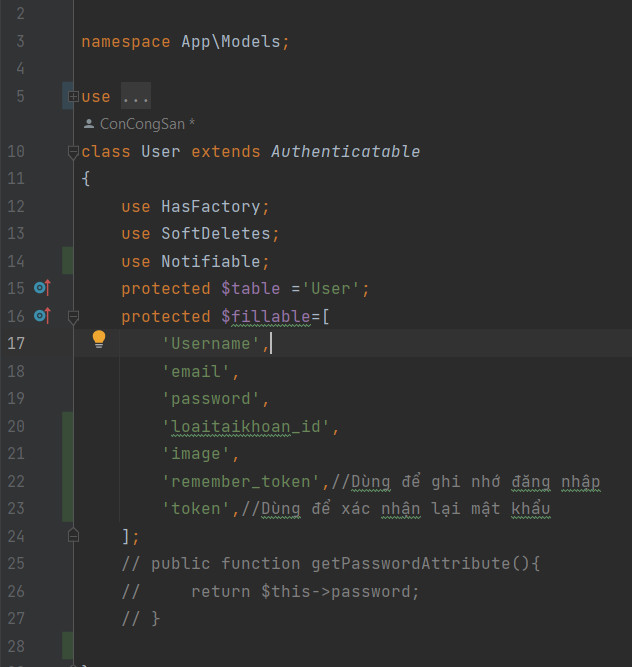

  - Create Route

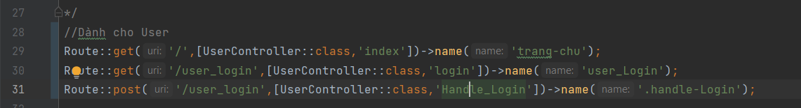

  - Handle login

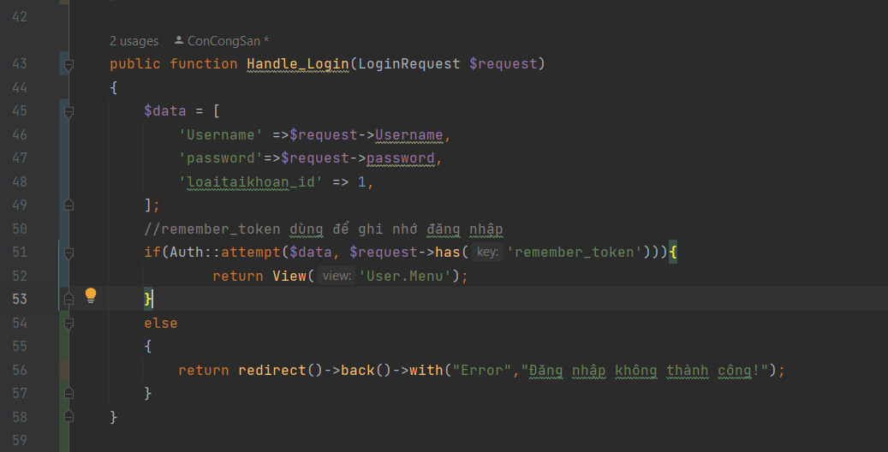
 User enters password and username using Auth::attempt method to check input data

**- Authentication API:**

- Add Migration
  
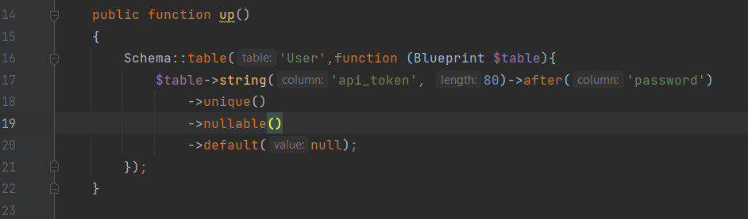
