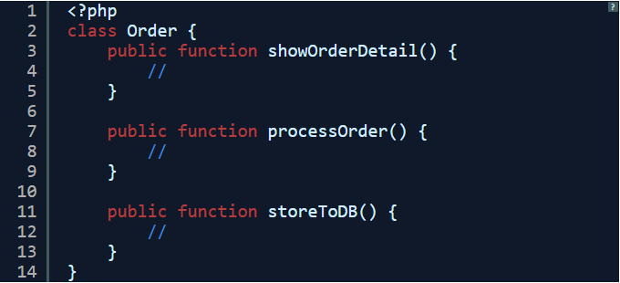
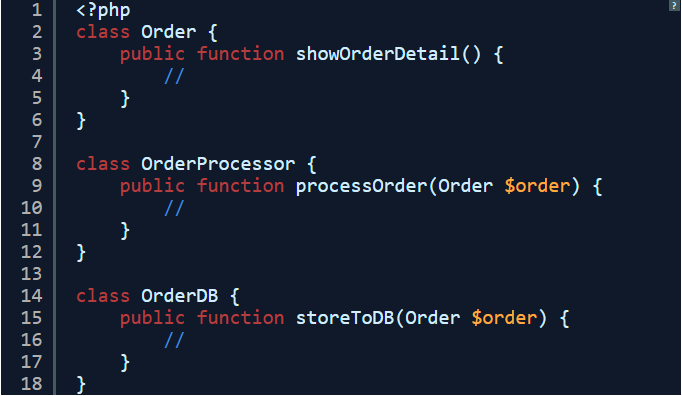
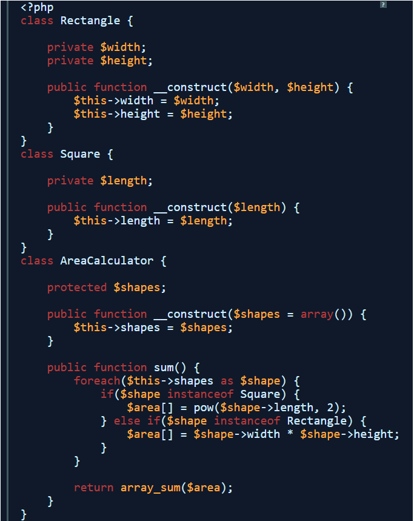
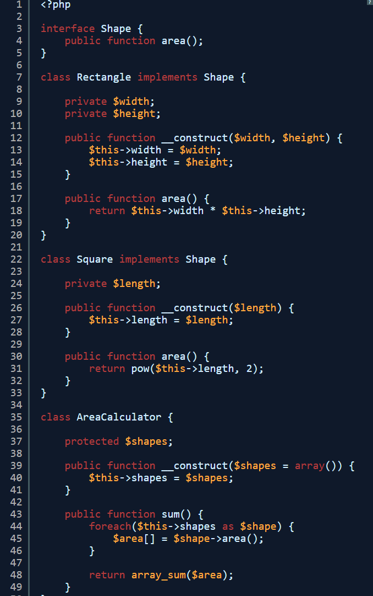
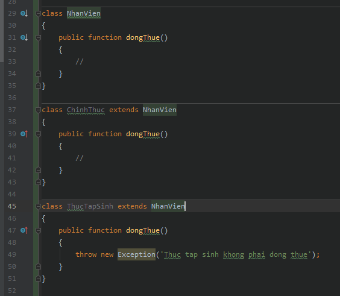
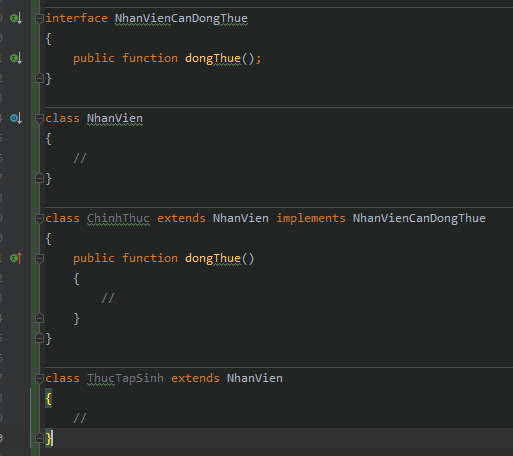
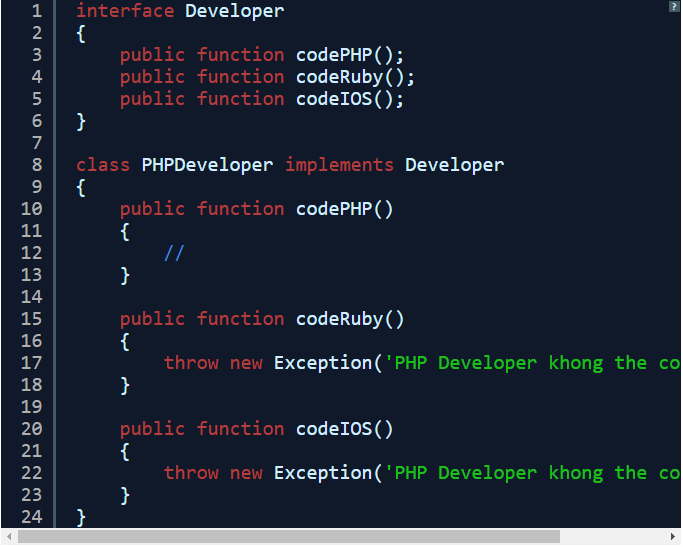
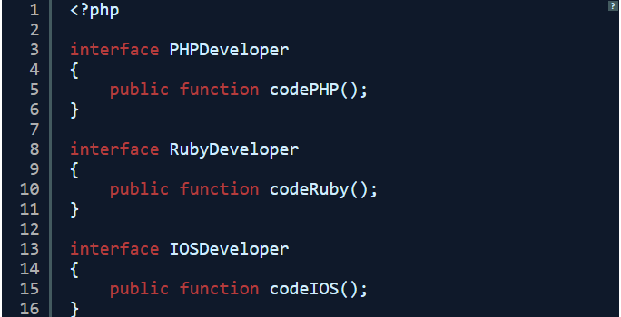

# Chapter 09: Coding principles

Mục tiêu: nắm được về một vài nguyên lý cơ bản trong lập trình.

## SOLID Principles

**What is SOLID**

SOLID is the abbreviation for the first 5 letters or in other words is a set of 5 design principles in object oriented programming. 
Robert C. Martin - a Mexican software engineer introduced and synthesized these principles.

SOLID helps developers to write code that is easy to read, understand, and maintain.

**SOLID PRINCIPLES**

**- S:** Single-responsibility principle

    - A class should have only one responsibility
    
Suppose we have a class as follows:

You can see that this Order class has up to 3 responsibilities. 
So later on, we add the order handling operations that cause this class to swell very large
In principle we should separate the 3 classes as follows:

**- O:** Open-closed principle

    - The class can be extended but not to change the old class
Example: I want to calculate the total area of an array consisting of the following geometry:

The above code allows us to calculate the area of a square and a rectangle, 
if now you want to calculate the area of a triangle, you must edit the sum () function of the AreaCalculator class. 
That is wrong of principle. We need to do the following:

With the above code, if you want to calculate more circles, triangles, 
you just need to create add a class and implement the Shape interface.

**- L:** Liskov substitution principle

    - Instances of subclasses can replace the parent class instance while still ensuring the correctness of the program.
A company has 2 types of employees: full-time employees, unpaid interns. 
For full-time employees, income tax should be paid and interns don't. 
You have 1 class NhanVien to be the parent class for the employees in the company as follows:

This rule is violated because calling dongThue() function of ThucTapSinh class will cause the program to error.
So you need to create a NhanVienCanDongThue interface out and what kind of employees need to pay taxes, 
we will implement it.

**- I:** Interface segregation principle

    - If the Interface is too large, we should split into smaller interfaces
For example you have a common interface for developers:

As you can see 1 PHPDeveloper implements Developer interface not related to ruby and ios. 
So in this case we should split into 3 interfaces:

**- D:** Dependency Inversion Principle

    - High-level modules should not depend on low-level modules. Both should depend on abstractions.
    Abstractions should not depend on details. Details should depend on abstractions.

## KISS - Keep it stupid simple

## DRY - Don't repeat yourself
    