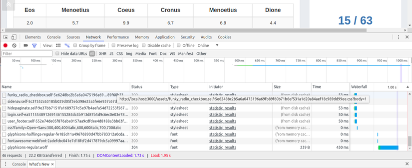

# Chapter 11: Dev tools

Mục tiêu: nắm được 1 vài tool hỗ trợ dev phổ biến.

## 1. Chrome dev tool
The Chrome Developer Tool is a suite of tools that are hugely supportive for developers built into Google Chrome. DevTools provides web developers with internal access to their browsers and web applications. Use DevTools to efficiently edit HTML, CSS, and JavaScript and get insights to optimize code.

**Elements**

This tab displays the HTML of the web page elements.
We can directly edit the CSS of an element in the right pane, see the results immediately.

**Networks**

On this tab, we can see all the things downloaded by the browser from the server: HTML, CSS, JS, images, ... 
You can also click on each request to see the results returned from the server, check error.

**Console**

We can directly enter the js code here to run, this is a great feature to be able to test each js code individually.
The errors related to javascript (not load, syntax, ...) will show up in this tab.

**Sources**

This tab shows the js files that the browser can load. At this tab, you can debug code js with breakpoints.

**References**

- [https://developers.google.com/web/tools/chrome-devtools/](https://developers.google.com/web/tools/chrome-devtools/)

- [https://developer.chrome.com/devtools](https://developer.chrome.com/devtools)

## 2. Ngrok service

ngrok secure introspectable tunnels to localhost webhook development tool and debugging tool.

run and publish a local website via ngrok

check request logs

## 3. SSH connection and key generation

learn how to generate a SSH key

how to connect to a server via SSH