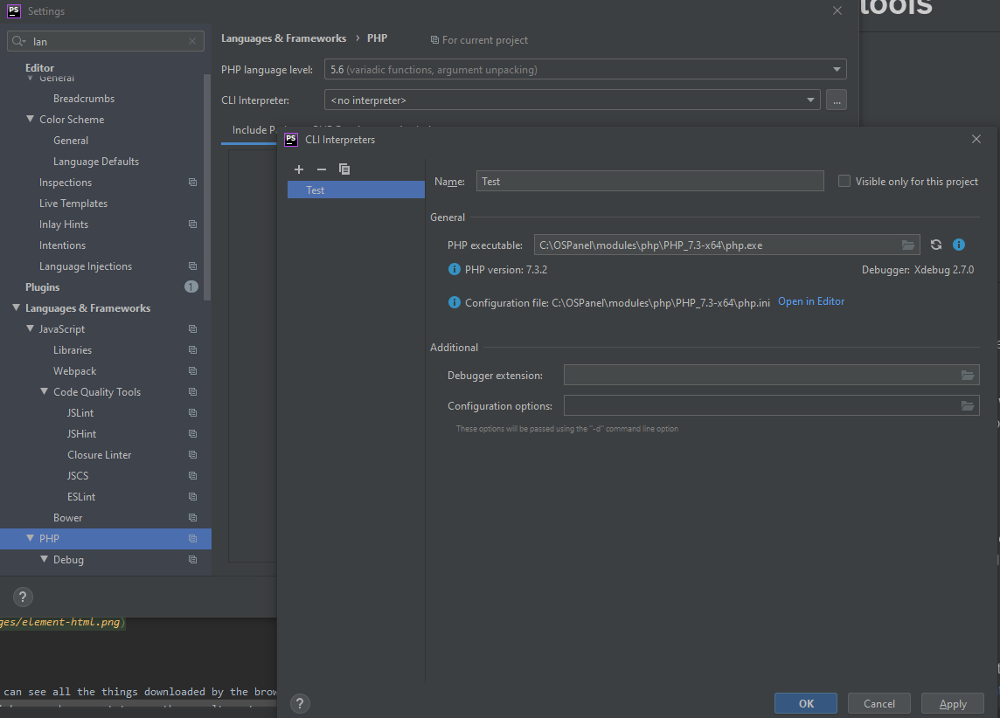
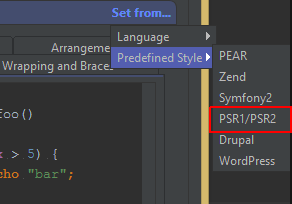
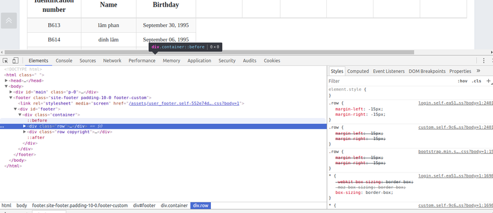
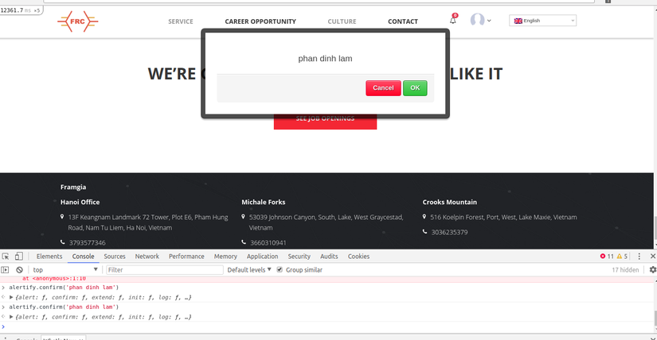
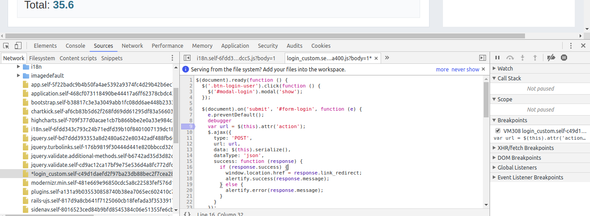

# **Development tools**

1. [GIT](#1-git)
    - [1.1 Basic commands](#11-basic-commands)
    - [1.2 Basic Get flow](#12-basic-get-flow)
2. [MySQL](#2-mysql)
3. [Apache](#3-apache)
4. [OpenServer](#4-openserver)
5. [PhpStorm](#5-phpstorm)
6. [Chrome dev tool](#6-chrome-dev-tool)

##1. GIT

Git is a distributed version control system
- Git stores information in the form of a list of file-based changes and changes made to each file over time.

- In projects where there are often lots of developers working in parallel, 
Git is essential to ensure there are no code conflicts between developers.

- Some of the benefits of Git:
     - Easy to use, fast, quick and safe operation.
     - Easily combine branches.
     - Just clone the source code from the repository or clone a modified version from the repository, 
     or a branch from the repository, and you can work anywhere.
     - Deployment your product easily.

### 1.1 Basic commands

This great GitHub commands cheat sheet saved my butt multiple times:
<https://www.atlassian.com/git/tutorials/atlassian-git-cheatsheet>

### 1.2 Basic Get flow
Check out the branch from the develop branch

Before checking out the branch you should pull the code back.

    - git pull

How to name the branch: id_task-description_task

    - git checkout "id_task-description_task"
    
After completing the assigned task, commit with the following syntax:

    - git commit -m "#id_task-description"
    
After committing, you push the code to the branch:

    - git push origin name_branch

- Some important Git terms:
#####1. Branch
- Branches represent specific instances of a repository separate from your main Project.
- Branch allows you to keep track of your changes to the repository, so you can roll back to earlier versions.

#####2. Commit
- Commit represents a specific moment in your project history. Using the commit and git add commands keeps your changes saved to local repository.

#####3. Checkout
- Use **git checkout** to switch between branches
    - git checkout "name-branch"
 
#####4. Fetch
- The git fetch command fetches the copies and downloads all branches to your computer.

#####5. Head
- Commits at the beginning of a branch are called Head. 
It represents the most recent commit of the repository you are working on.

#####6.  Index
- Whenever you add, edit, delete, or change a file, it stays in the index until you're ready to commit.
  Use git status to see those changes (file index).

#####7. Master
- Master is the main branch of your repository. It includes the most recent changes and commits.

#####8. Merge
- The git merge command combines pull requests to add changes from branch to branch.

#####9. Origin
- git push origin master => to push local changes to the main branch.

#####10. Pull
- To pull all of the pushed code back to your branch
    - git pull

#####11. Push
- The git push command is used to push the code to your branch.

#####12. Rebase
- The git rebase command allows you to split, move, and exit a commit. It can also be used to combine two branches.

#####13. Stash
- Lệnh git stash để lưu lại các công việc mình đang làm việc trên branch hiện tại, 
dùng git stash apply để quay trở lại thời điểm chưa git stash.  

##2. MySQL
- MySql is an open source database administration system.
- Some free tools to use as MySql:
    - MySql Workbench (Mac, Windows, Linux), free, open source.
    - Sequel Pro (Mac), free, open source.
    - HeidiSQL (Windows), free.
    - PhpMyAdmin (web app), free, open source.
    
- How MySql works
    - MySql creates tables to store data, defining the relationships between those tables.
    - The client sends the SQL request with a special command on MySql.
    - The application on the server will respond to the information and return the results on the client machine.
    
##3. Apache
- Apache (Apache HTTP Server) is a server program that communicates using the HTTP protocol 
and works on most operating systems such as Linux, Windows, Unix and many other operating systems.

- Apache plays an important role in the development of the world web www.

- How to install Apache on Windows:
    - Step 1: **Download Apache** 64 bit or 32 bit version.
    - Step 2: install Apache. After downloading, proceed to extract the Apache24 directory to drive C.
    - Step 3: Start Apache: Go to the folder ** C: Apache24bin ** and run the file ** httpd.exe **, 
    when the message "** It works! **" pops up or if you go to http: // localhost, 
    check the line "* * It works! ** "then you have installed it successfully.

##4. OpenServer
- OpenServer is a software for creating webserver on windows from Russia, and there are many good utilities built in.
- OpenServer provides users with a variety of platforms to test their products and run well in all environments.
- OpenServer has built-in environment variables within it when working with Laravel.

- Download và install OpenServer
    - Step 1: Access the [link download](https://ospanel.io/) and select an installation file and corresponding configuration file to download and install.
    - Step 2: Once downloaded we will have a file with the name Open_server _ ***. Exe, run the file to begin the installation.
    - Step 3: Configure and use OpenServer.
    - To make it easier to visualize the installation process, you go to [Link cài đặt](https://freetuts.net/cai-dat-openserver-va-tao-domain-ao-tren-localhost-281.html)
    

##5. PhpStorm
- Phpstorm is a cross-platform, integrated development environment (IDE) for PHP, 
built by JetBrains, the world's leading software maker for programming and development tools.

- PhpStorm provides an editor for PHP, HTML and JavaScript with fast code analysis, 
error prevention, and automatic refactoring for PHP and JavaScript code.

- By 2020, there are about 600,000 users using copyright PhpStorm software worldwide.

**Configure PHPStorm interpreter:**

1. In PHPStorm, go to "File" menu (Windows), then Settings (Ctrl+Alt+S).
2.Go to "Languages & Frameworks", then click on "PHP".
3. Click the **_..._** button from the "CLI Interpret" field.
4. Add a new interpreter by clicking the + button.
5. Here, provide the PHP Executable path to the php.exe we've spotted earlier:

If done correctly, PHPStorm will display the PHP version & the path to the configuration file (php.ini)

**Setup format code**

Open up the PHPStorm IDE. Into the [ File ] -> [ Setting ] -> [ Editor ] -> [ Code Style ] -> [ PHP ]
    
    - Scheme: Default IDE
    - Click set from …
    

PhpStorm can help ensure your code adheres to whichever coding standard you follow. 
Press Ctrl+Alt+L on Windows/Linux to reformat the source code for the current selection or the entire file if nothing is selected.

**Setup unit test**

Open up the PHPStorm IDE. Into the [ File ] -> [ Setting ] -> [ Languages & Frameworks ] -> [ PHP ] -> [ Test Frameworks ]

**Install Phpstorm**
- Please refer to the following link:
[link download and setup phpstorm](https://khophanmem24h.com/download-phpstorm-2019/)

##6. Chrome dev tool
The Chrome Developer Tool is a suite of tools that are hugely supportive for developers built into Google Chrome. 
DevTools provides web developers with internal access to their browsers and web applications. 
Use DevTools to efficiently edit HTML, CSS, and JavaScript and get insights to optimize code.

**Elements**

This tab displays the HTML of the web page elements.
We can directly edit the CSS of an element in the right pane, see the results immediately.

**Networks**

On this tab, we can see all the things downloaded by the browser from the server: HTML, CSS, JS, images, ... 
You can also click on each request to see the results returned from the server, check error.

**Console**

We can directly enter the js code here to run, this is a great feature to be able to test each js code individually.
The errors related to javascript (not load, syntax, ...) will show up in this tab.

**Sources**

This tab shows the js files that the browser can load. At this tab, you can debug code js with breakpoints.

**References**

- [https://developers.google.com/web/tools/chrome-devtools/](https://developers.google.com/web/tools/chrome-devtools/)

- [https://developer.chrome.com/devtools](https://developer.chrome.com/devtools)

## 7. Ngrok service

ngrok secure introspectable tunnels to localhost webhook development tool and debugging tool.

## 8. SSH connection and key generation

