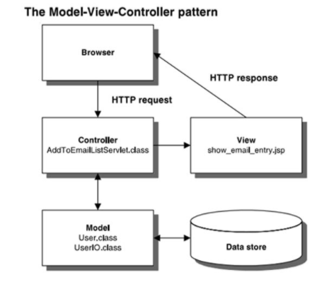
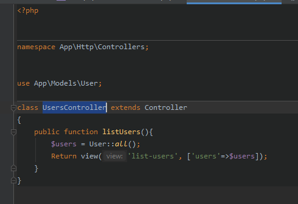
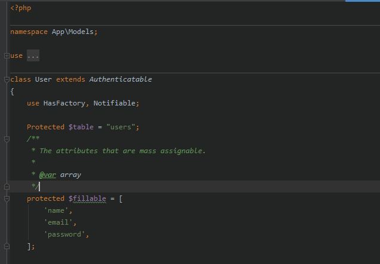
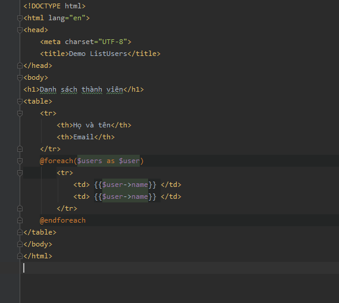
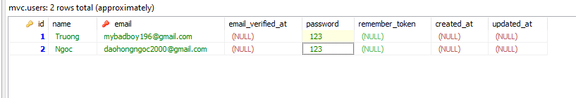
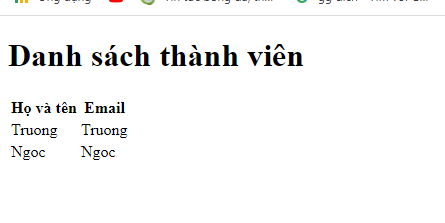

# **Laravel framework**

1. [About Laravel](#1-about-laravel)
2. [Learning Laravel](#2-learning-laravel)
3. [Install laravel](#3-install-laravel)
4. [The structure of Laravel](#4-the-structure-of-laravel)

##1. About Laravel

Laravel is a free and open source PHP Framework, developed by Taylor Otwell 
and targeted to support the development of web applications in a model-view-controller (MVC) architecture.
Laravel includes an easy-to-understand syntax, Many different utilities support deployment into application maintenance.

##2. Learning Laravel

Laravel has the most extensive and thorough documentation and video tutorial library of any modern web application framework. 
The [Laravel documentation](https://laravel.com/docs/8.x) is in-depth and complete, making it a breeze to get started learning the framework.

If you're not in the mood to read, [Laracasts](https://laracasts.com/) contains over 1100 video tutorials covering a range of topics including Laravel, 
modern PHP, unit testing, JavaScript, and more. Boost the skill level of yourself and your entire team by digging into our comprehensive video library.

##3. Install laravel

- [Laravel install](https://laravel.com/docs/8.x/installation)

##4. The structure of Laravel

- **app:** Contains directories, php files, libraries, models.

    **- Console:** Contains files that define the commands on artisan.
    
    **- Exception:** Contains file management and error navigation.
    
    **- Http** 
    
        - Controller: Contains the controllers of the project.
        - Middleware: Contains file filtering and blocking requests.
        - Kernel.php: Contains file filtering and blocking requests.
        
    **- Providers:** The providers do the job binding vào service container.
    
    **- User.php:** This is the User model that Laravel defines itself for us.
    
**- bootstrap:** Contains system navigation file.

**- config:** Contains all Laravel configuration files.

**- database:** Contains the file directories on the database.

    - migrations: Contains files that define, initialize and edit tables.
    - seeds: Contains insert data definition files into the database.
    - factory: Contains files that define data table columns to create virtual data.
    
**- public:** Contains css, js, image files.

    - index.php: This is the root file of Laravel.
    
**- resources:** Contains views, language (language) of the project.

**- routes:** Contains the files that define the routers, handling router navigation including: **web, api**

**- storage:** Contains system files cache, session, ...

**- tests:** Contains test files

**- vendor:** Contains the packages laravel requires.

**- .env:** Is the laravel main configuration file such as key app, database.

**- .env.example:** Laravel configuration file.

**- composer.json:** composer's file.

**- composer.lock:** composer's file.

**- package:** The nodejs configuration file (containing the packages needed for projects).

**- phpunit.xml:** The xml file of phpunit used for testing project.

**- server.php:** Is the file for artisan to point to creating the server when typing the command _**php artisan serve**_.

**- artisan:** Laravel command executable file.

##5. What is MVC pattern?

MVC is an acronym which stands for 3 words Model - View - Controller. 
Source code model into 3 parts, corresponding to each word. 
Each word corresponds to a separate activity in a pattern.

**Functions of each component in the MVC model:**

**- Model (M):** The part that stores all of the application's data. 
This part is a bridge between two components below is View and Controller.
The model shown in the form is a database.
It shows operations with the database such as retrieving and processing data.

**- View (V):** This is the interface (theme) for the user. 
It is responsible for displaying data and helping users interact with the system.

**- Controller (C):** Controller is responsible for handling user requests through the view. 
From there, Controller gives the data relevant to the user. 
Besides, Controller also has the function to connect to the model.

##6. Activity flow of MVC

- After receiving a request from the browser, Controller will interact with the model to get data. 
The model interacts with the database to get data, 
the returned data is sent back to the Model, from the Model sent back to the Controller, 
the Controller calls View to transfer the data just received from the Model to the View, 
the View will render that data to the browser.

##7. Example

Here is an example taking all users for the user:

**- Controller:**

**- Model:**

**- View:**

**- Database table users:**

**- User Interface:**

