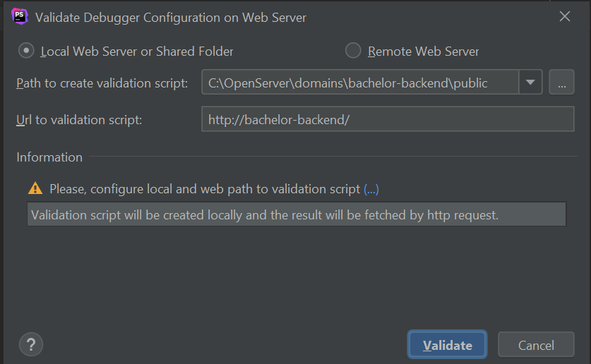
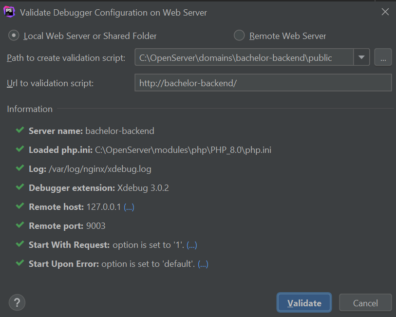

- [Check settings in php.ini](#check-settings-in-phpini)
- [Activate from browser](#activate-from-browser)
- [Activate from postman](#activate-from-postman)
- [Activate from console](#activate-from-console)


## Check settings in php.ini

OpenServer -> Advance -> Configuration -> open php.ini file
Add xdebug config


```
xdebug.mode = debug
xdebug.client_host = 127.0.0.1
xdebug.client_port = 9003
xdebug.start_with_request=yes
xdebug.log="/var/log/nginx/xdebug.log"
xdebug.idekey = PHPSTORM
xdebug.discover_client_host=false
```

Open PHPSTORM Settings: activate PHP version, path
https://www.jetbrains.com/help/phpstorm/configuring-xdebug.html#updatingPhpIni

Run -> Webserver Debug Validation



Place a break point in the code

## Activate from browser

- install xdebug chrome plugin
- activate the plugin and reload the page

## Activate from postman

Add `XDEBUG_SESSION_START=PHPSTORM` to the query string

## Activate from console 

Example

```
php -dxdebug.remote_autostart=on -dxdebug.remote_connect_back=off -dxdebug.remote_host=127.0.0.1 -dxdebug.idekey=PHPSTORM -dxdebug.mode-debug -dxdebug.client_port=9003 artisan command_name
```